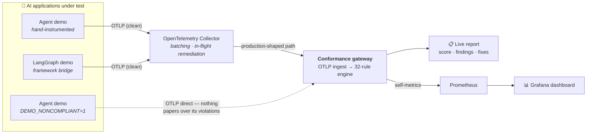
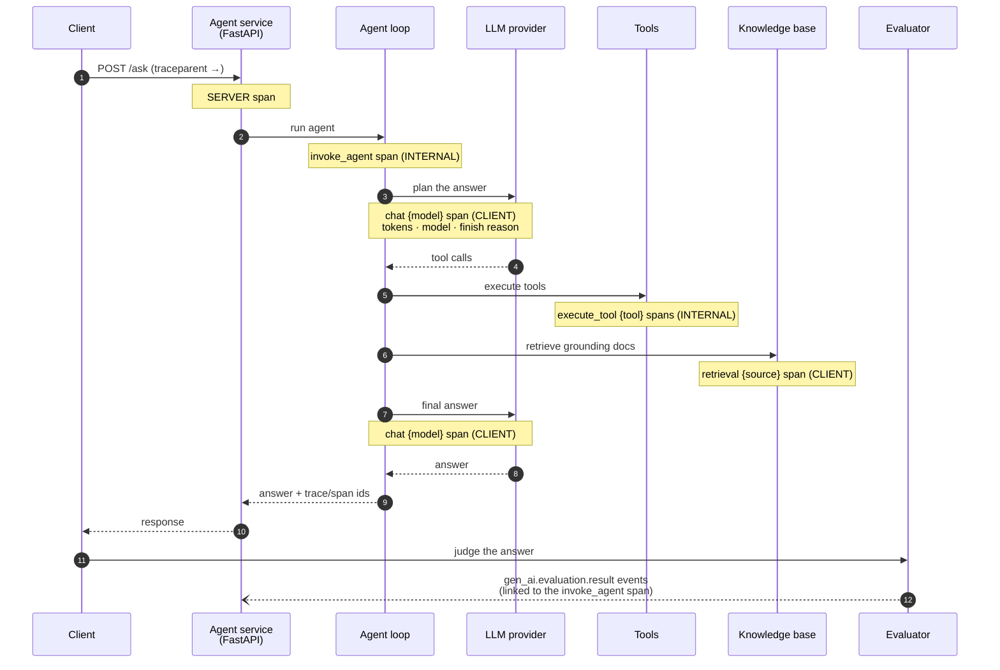
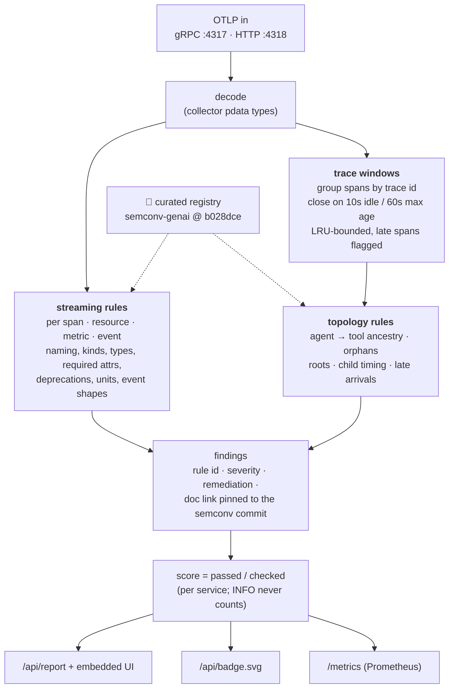

# genai-otel-ingest-conformance

> Does your AI agent emit telemetry you can actually trust? This suite ingests OpenTelemetry data from GenAI applications and grades it against the [OpenTelemetry GenAI semantic conventions](https://github.com/open-telemetry/semantic-conventions-genai) — live at the ingest path, or offline as a CI gate.

[](https://github.com/jjsanda/genai-otel-ingest-conformance/actions/workflows/ci.yaml)
[](https://github.com/jjsanda/genai-otel-ingest-conformance/actions/workflows/e2e-kind.yaml)
[](LICENSE)
[](go.mod)
[](https://github.com/open-telemetry/semantic-conventions-genai/tree/b028dceecdad117461a785c3af35315e7184e813)

## What is this? (plain English)

Companies running AI assistants and agents in production need to see what those agents do: which model was called, which tools the agent used, how many tokens were spent, where the time went, what failed, and how good the answers were. That visibility only works if every application reports its telemetry in the same standard shape — the OpenTelemetry **GenAI semantic conventions**.

This project is a **quality gate for that telemetry**. It receives the observability data an AI application emits and answers one question: *is this data complete, well-formed, and standards-conformant enough to be trusted by dashboards, alerts, and cost reports?* When the answer is no, it says exactly what is wrong, why it matters, and how to fix it — with a link into the exact version of the conventions it checked against.



## See it in two minutes

```sh
docker compose up -d --build
```

Then open **http://localhost:8080**. Within ~30 seconds the live report shows the whole story on one screen. (Every published host port is overridable if something is already listening — `GATEWAY_PORT=18080 GRAFANA_PORT=13000 docker compose up -d` and so on; see the `ports:` entries in [docker-compose.yaml](docker-compose.yaml) for the full list.)

| Service | What it demonstrates | Score |
|---|---|---|
| `agent-demo` | hand-instrumented FastAPI agent → collector → gateway | **100%** |
| `demo-langgraph-agent` | real LangGraph app bridged by a custom callback handler | **100%** |
| `unknown_service` | the same agent with `DEMO_NONCOMPLIANT=1`, shipping straight to the gateway | **~73%**, hundreds of findings |

The broken service is the demo's point: it emits deprecated attribute names (`gen_ai.system`), token counts as strings and negatives, legacy prompt-content events, a missing `service.name`, tool spans without `gen_ai.tool.name` — and every one of those is caught, explained, and linked to the pinned conventions. It bypasses the collector deliberately: the collector's `transform` processor *remediates* one of those mistakes in flight on the compliant path, and a conformance check must judge what the application actually emits, not what the pipeline papered over.

Also running: **Grafana** at http://localhost:3000 (provisioned dashboard over the gateway's self-metrics) and **Prometheus** at http://localhost:9090.

## How a request becomes judged telemetry



The demo agents run a deterministic **mock LLM by default** — the whole stack works with zero API keys, free and reproducible (that's why CI can assert exact scores). Setting `OPENAI_API_KEY` or `ANTHROPIC_API_KEY` switches the same code paths to real providers ([ADR-0003](docs/adr/0003-mock-first-llm-providers.md)). The evaluator judges every answer (correctness, groundedness, tool precision) and emits the results as `gen_ai.evaluation.result` events carrying the evaluated span's identity — evaluation telemetry is a first-class signal here, with its own conformance rules.

## What gets checked

**32 rules** across five categories, each with a stable ID, a severity mapped from the conventions' requirement language, a remediation hint, and a doc link pinned to the exact semconv commit. The full catalog lives in [docs/rules.md](docs/rules.md) — generated from the code by `make docs` and kept in sync by CI.



Highlights beyond attribute checking:

- **Per-operation, span-kind-aware requirements.** `gen_ai.provider.name` is required on a CLIENT `invoke_agent` span but *not* on an INTERNAL one — encoding that nuance is the difference between a useful gate and a false-positive generator.
- **Trace topology.** "Request → agent → tool → retrieval → LLM" continuity is only checkable across spans: tool spans floating outside their agent, orphaned parents, missing roots, children escaping their parent's time bounds.
- **Bounded trace assembly.** Spans arrive in arbitrary batches; the gateway groups them into windows with explicit memory bounds and honest late-arrival semantics ([ADR-0004](docs/adr/0004-bounded-trace-windows.md)) — late spans are themselves a finding about mis-tuned export batching.
- **Deprecation migration.** `gen_ai.system` → `gen_ai.provider.name`, prompt/completion token names, legacy content events — each finding names the replacement.
- **The score is a contract** ([ADR-0006](docs/adr/0006-score-and-severity.md)): one check = one scoreable rule × one entity; INFO hints never count. CI asserts the demo scores *exactly* 1.0 (a run is currently 717/717 checks) and that the broken mode trips *exactly* the golden rule set.

## Use it on your own telemetry

**As a CLI** — record your app's OTLP output (protobuf, OTLP/JSON, or collector file-exporter JSONL) and validate offline:

```sh
go install github.com/jjsanda/genai-otel-ingest-conformance/cmd/genai-conformance@latest
# (or, in a clone: make build → bin/genai-conformance)

genai-conformance validate --format markdown my-app.traces.binpb my-app.metrics.binpb
# exit 0 = conformant · 1 = blocking findings · 2 = usage error
```

**As a GitHub Action** — fail the build on nonconformant AI telemetry:

```yaml
- uses: jjsanda/genai-otel-ingest-conformance@v0.1.0
  with:
    files: out/run.traces.binpb out/run.metrics.binpb
    strict: "true"
```

**As a live gateway** — point any OTLP exporter (or a collector's `otlp` exporter) at `genai-conformance serve`, optionally with `--forward` to sit in-line in an existing pipeline, and read `/api/report`, `/api/badge.svg`, or the Prometheus metrics.

## Kubernetes

The same topology deploys to Kubernetes via kustomize (probes, resource bounds, non-root security contexts), and one script proves it end to end in [kind](https://kind.sigs.k8s.io/):

```sh
hack/e2e-kind.sh
```

builds the images, side-loads them into a digest-pinned cluster, deploys, drives a bounded traffic Job, and asserts the live report: compliant services at exactly 1.0, the broken one below 0.8 with every golden rule firing. It runs in CI on every push to main. Guide: [docs/quickstart-k8s.md](docs/quickstart-k8s.md).

## Living with a moving spec

The GenAI conventions are **Development status** — they moved to a dedicated repository and still change without tagged releases. This suite treats that as an engineering problem, not a footnote ([ADR-0002](docs/adr/0002-curated-registry-pinned-to-sha.md)):

- Every rule is keyed to a **hand-curated registry pinned to commit [`b028dce`](https://github.com/open-telemetry/semantic-conventions-genai/tree/b028dceecdad117461a785c3af35315e7184e813)**; the upstream model YAML is vendored, and cross-check tests fail if the transcription ever disagrees with it.
- A **weekly drift workflow** diffs upstream `main` against the pin and reports what moved, so a spec change is a visible upgrade task instead of silent rot.
- Every finding's doc link points at the pinned commit — links never lie about which version of the spec they cite.

## Code map

Where each part lives, one hop from here:

| Topic | Where to look |
|---|---|
| OTLP ingest on collector-native types | [`internal/ingest/`](internal/ingest/) (gRPC + HTTP receivers, gzip, pdata), [`internal/server/`](internal/server/) |
| GenAI semantic conventions | [`internal/registry/curated/`](internal/registry/curated/) (per-operation matrices), [`crosscheck_test.go`](internal/registry/crosscheck_test.go), [drift workflow](.github/workflows/semconv-drift.yaml) |
| Trace assembly under bounded memory | [`internal/assembly/`](internal/assembly/) (bounded windows, LRU, late arrivals), [ADR-0004](docs/adr/0004-bounded-trace-windows.md) |
| Context propagation | trace-topology rules in [`internal/rules/trace.go`](internal/rules/trace.go), traceparent-propagating [traffic generator](apps/agent-demo/scripts/traffic.py) |
| AI framework integration | [`apps/langgraph-demo/src/langgraph_demo/otel_callbacks.py`](apps/langgraph-demo/src/langgraph_demo/otel_callbacks.py) — a LangChain callback → semconv bridge in ~300 lines |
| Agentic patterns (planning, tool use, retrieval) | [`apps/agent-demo/src/agent_demo/agent.py`](apps/agent-demo/src/agent_demo/agent.py), [`tools.py`](apps/agent-demo/src/agent_demo/tools.py), [`retrieval.py`](apps/agent-demo/src/agent_demo/retrieval.py) |
| LLM evaluation | [`apps/agent-demo/src/agent_demo/evals/`](apps/agent-demo/src/agent_demo/evals/) (judges → `gen_ai.evaluation.result` events), event rules in [`internal/rules/event.go`](internal/rules/event.go) |
| Developer tooling | [`validate`](internal/cli/validate.go) exit-code contract, JUnit output, [golden fixtures](testdata/fixtures/), [`action.yml`](action.yml), generated [rule docs](docs/rules.md) |
| Kubernetes | [`deploy/k8s/`](deploy/k8s/), [`hack/e2e-kind.sh`](hack/e2e-kind.sh) |
| Self-observability | [`internal/server/prom.go`](internal/server/prom.go), [provisioned Grafana dashboard](deploy/compose/grafana/dashboards/genai-conformance.json) |

## Related work (and why this exists)

- [`weaver registry live-check`](https://github.com/open-telemetry/weaver) validates attributes against a semconv registry, generically. This suite is opinionated about *GenAI application telemetry as a whole*: trace topology, cross-signal evaluation correlation, severity-mapped scoring with a CI exit-code contract, migration hints, and a live report UI.
- The semconv-genai repo's own [`reference/`](https://github.com/open-telemetry/semantic-conventions-genai) compliance matrices validate *instrumentation libraries* against mock providers; this validates *your application's* emitted telemetry, whatever produced it.
- [OpenLLMetry](https://github.com/traceloop/openllmetry) and [OpenInference](https://github.com/Arize-ai/openinference) *emit* GenAI telemetry. This project sits on the other side of the wire and judges what was emitted.

Details in [ADR-0001](docs/adr/0001-standalone-gateway-not-collector-processor.md).

## Repository layout

```
cmd/genai-conformance/    one binary: serve · validate · rules
internal/
  registry/               curated semconv registry (pinned, cross-checked)
  engine/                 rule engine, findings, scoring
  rules/                  the 32-rule catalog
  ingest/ assembly/       OTLP receivers · bounded trace windows
  server/ report/ webui/  gateway, live report, badge, embedded UI
  otlpio/                 offline readers (binpb · OTLP/JSON · JSONL)
apps/agent-demo/          hand-instrumented agent + evals + broken mode
apps/langgraph-demo/      LangGraph + custom callback bridge
deploy/                   collector config · compose monitoring · kustomize
docs/                     ADRs · generated rule catalog · diagrams · k8s guide
hack/                     e2e-kind · demo gate · semconv sync/drift · diagrams
testdata/fixtures/        OTLP fixtures with golden reports
```

## Roadmap

- Package the engine as an OpenTelemetry Collector processor (the engine is already a plain library; this is packaging, not a rewrite).
- Multi-version registry support — validate against several semconv snapshots and report per-version conformance.
- MCP (Model Context Protocol) conventions, once they settle upstream.

## License

[Apache-2.0](LICENSE)
